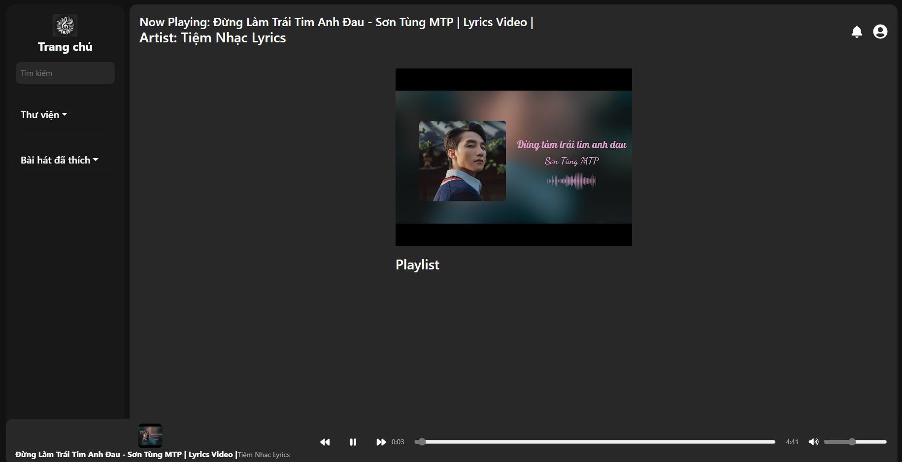
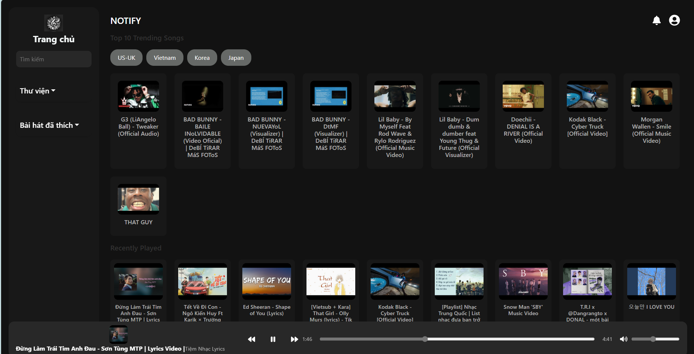

# 🎶 Giới Thiệu Ứng Dụng Nghe Nhạc YouTube

Chào mừng bạn đến với ứng dụng web nghe nhạc được phát triển từ nguồn dữ liệu của YouTube. Ứng dụng này cho phép bạn dễ dàng tìm kiếm, lựa chọn và thưởng thức âm nhạc yêu thích.

**Công nghệ sử dụng:**

*   **Frontend:** React
*   **API:** YouTube Data API

---

## 🚀 Hướng Dẫn Sử Dụng

Dự án này được khởi tạo bằng [Create React App](https://github.com/facebook/create-react-app), một bộ công cụ mạnh mẽ giúp đơn giản hóa quá trình xây dựng ứng dụng React.

### Các Lệnh Cơ Bản

Trong thư mục dự án, bạn có thể sử dụng các lệnh sau:

*   **`npm start`**
    
    Khởi chạy ứng dụng trong chế độ phát triển.
    Truy cập [http://localhost:3000](http://localhost:3000) để xem ứng dụng trên trình duyệt.
    Trang sẽ tự động tải lại khi có thay đổi.
    Bạn cũng có thể theo dõi các lỗi lint trong console.

*   **`npm test`**
    
    Khởi chạy trình kiểm thử ở chế độ tương tác.
    Xem thêm về [running tests](https://facebook.github.io/create-react-app/docs/running-tests) để biết thêm chi tiết.

*   **`npm run build`**
    
    Xây dựng ứng dụng cho môi trường production.
    Kết quả sẽ được lưu vào thư mục `build`.
    Lệnh này tối ưu và đóng gói mã React, đảm bảo hiệu suất tốt nhất.
    Ứng dụng của bạn đã sẵn sàng để triển khai!
    Tìm hiểu thêm về [deployment](https://facebook.github.io/create-react-app/docs/deployment).

*   **`npm run eject`**
    
    ⚠️ **Lưu ý:** Đây là thao tác **một chiều** và **không thể hoàn tác**.
    Nếu bạn muốn tùy chỉnh sâu hơn các công cụ xây dựng và cấu hình, hãy sử dụng lệnh này.
    Lệnh này sẽ sao chép các tệp cấu hình và các thư viện phụ thuộc (webpack, Babel, ESLint, ...) vào dự án của bạn, cho phép bạn kiểm soát hoàn toàn.

    Tuy nhiên, hãy cân nhắc kỹ trước khi sử dụng `eject` vì bạn sẽ phải tự mình quản lý các công cụ này.

---

## 📚 Tìm Hiểu Thêm

*   **Tài liệu Create React App:** [https://facebook.github.io/create-react-app/docs/getting-started](https://facebook.github.io/create-react-app/docs/getting-started)
*   **Tài liệu React:** [https://reactjs.org/](https://reactjs.org/)

---

## ⚙️ Khởi Chạy Server

Để server hoạt động, hãy chuyển đến thư mục `server` và chạy lệnh `npm start`. Server sẽ được khởi chạy tại cổng `5000`.

---

## ⚠️ Lưu Ý Quan Trọng

Các phần dưới đây đã được chuyển đến tài liệu chính thức của Create React App:

*   **Code Splitting:** [https://facebook.github.io/create-react-app/docs/code-splitting](https://facebook.github.io/create-react-app/docs/code-splitting)
*   **Analyzing the Bundle Size:** [https://facebook.github.io/create-react-app/docs/analyzing-the-bundle-size](https://facebook.github.io/create-react-app/docs/analyzing-the-bundle-size)
*   **Making a Progressive Web App:** [https://facebook.github.io/create-react-app/docs/making-a-progressive-web-app](https://facebook.github.io/create-react-app/docs/making-a-progressive-web-app)
*   **Advanced Configuration:** [https://facebook.github.io/create-react-app/docs/advanced-configuration](https://facebook.github.io/create-react-app/docs/advanced-configuration)
*   **Deployment:** [https://facebook.github.io/create-react-app/docs/deployment](https://facebook.github.io/create-react-app/docs/deployment)
*   **`npm run build` fails to minify:** [https://facebook.github.io/create-react-app/docs/troubleshooting#npm-run-build-fails-to-minify](https://facebook.github.io/create-react-app/docs/troubleshooting#npm-run-build-fails-to-minify)

---

## 🖼️ Hình Ảnh Giao Diện

**Trang chủ:**

**Trang đăng nhập:**

**Trang nghe nhạc:**

**Các trang khác:**

